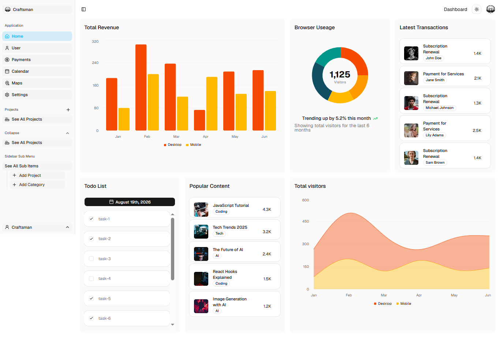

# 🚀 Modern Dashboard

Craftsman Dashboard is a modern, feature-rich admin panel built with Next.js, TypeScript, Tailwind CSS, and Shadcn UI. It features an interactive drag-and-drop calendar, location tracking with OpenStreetMap API, client-side data persistence, and a clean, responsive modular UI designed for seamless user management and project tracking.

[🌐 Live Demo](https://modern-dashboard-jg27elk1g-mohab-elhashems-projects.vercel.app)



### 🛠 Tech Stack

* **Framework:** [Next.js 16] (App Router & Server Components for fast navigation & SEO)
* **Language:** [TypeScript] (Strict type-safety & enhanced DX)
* **Styling & UI:** [Tailwind CSS] with [Shadcn UI] & [Radix UI] primitives
* **Form Management & Validation:** [React Hook Form] + [Zod] via `@hookform/resolvers`
* **Data Visualization:** [Recharts] & [Pigeon Maps]
* **Data Tables:** [TanStack Table v9]
* **Icons & Themes:** [Lucide React] &  (Dark/Light mode support)
* **Utilities:** `date-fns`, `clsx`, `tailwind-merge`, `class-variance-authority`


### ✨ Key Features

* **⚡ Lightning-Fast Navigation & SSR:** Leverages **Next.js Server Components** and optimized routing to deliver high-performance page loads and smooth client-side transitions.
* **🛡️ End-to-End Type Safety:** Fully typed codebase with **TypeScript** to prevent runtime errors and ensure reliable data structures across components.
* **🎨 Modern Responsive UI & Theme Switcher:** Styled with **Tailwind CSS** and **Shadcn UI** for a sleek design, complete with seamless **Dark/Light mode** switching powered by `next-themes`.
* **📋 Robust Form Validation:** Seamless form state handling using **React Hook Form** paired with strict schema validation using **Zod**.
* **📊 Interactive Analytics & Charts:** Visualizes complex data trends effortlessly using **Recharts**.
* **🗺️ Interactive Map Integration:** Embeds light, responsive mapping directly into the dashboard via **Pigeon Maps**.
* **📈 Dynamic & Sortable Data Tables:** Complex data display with sorting, filtering, and pagination support using **TanStack React Table**.
* **📅 Date Pickers & Management:** User-friendly date range selection powered by **React Day Picker** and formatted seamlessly with **Date-fns**.


This is a [Next.js](https://nextjs.org) project bootstrapped with [`create-next-app`](https://nextjs.org/docs/app/api-reference/cli/create-next-app).

## Getting Started

First, run the development server:

```bash
npm run dev
# or
yarn dev
# or
pnpm dev
# or
bun dev
```

Open [http://localhost:3000](http://localhost:3000) with your browser to see the result.

You can start editing the page by modifying `app/page.tsx`. The page auto-updates as you edit the file.

This project uses [`next/font`](https://nextjs.org/docs/app/building-your-application/optimizing/fonts) to automatically optimize and load [Geist](https://vercel.com/font), a new font family for Vercel.

## Learn More

To learn more about Next.js, take a look at the following resources:

- [Next.js Documentation](https://nextjs.org/docs) - learn about Next.js features and API.
- [Learn Next.js](https://nextjs.org/learn) - an interactive Next.js tutorial.

You can check out [the Next.js GitHub repository](https://github.com/vercel/next.js) - your feedback and contributions are welcome!

## Deploy on Vercel

The easiest way to deploy your Next.js app is to use the [Vercel Platform](https://vercel.com/new?utm_medium=default-template&filter=next.js&utm_source=create-next-app&utm_campaign=create-next-app-readme) from the creators of Next.js.

Check out our [Next.js deployment documentation](https://nextjs.org/docs/app/building-your-application/deploying) for more details.
